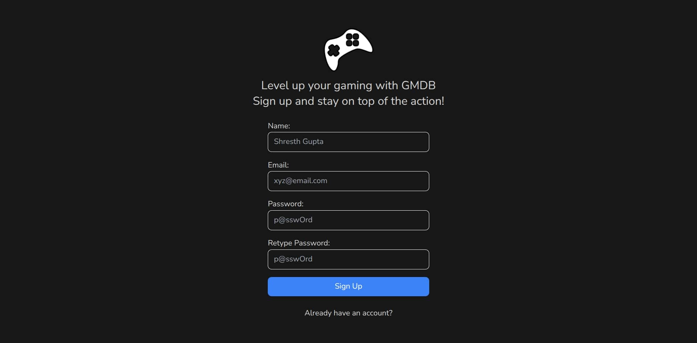
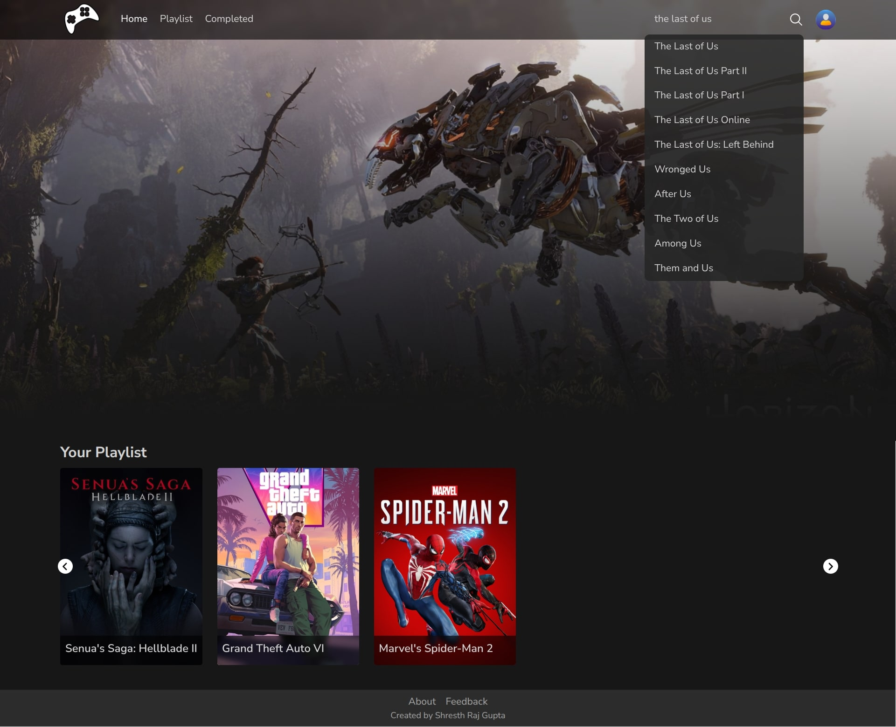
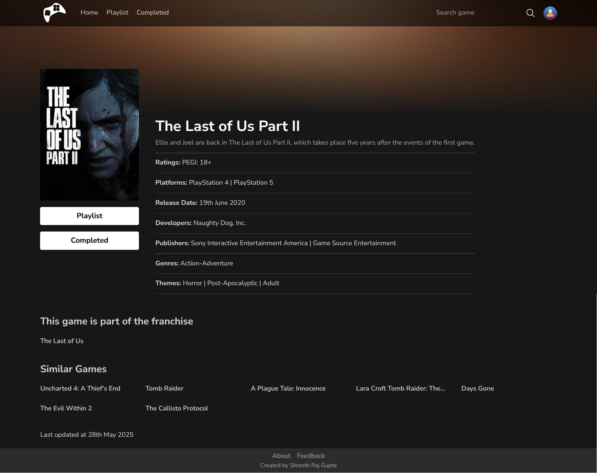
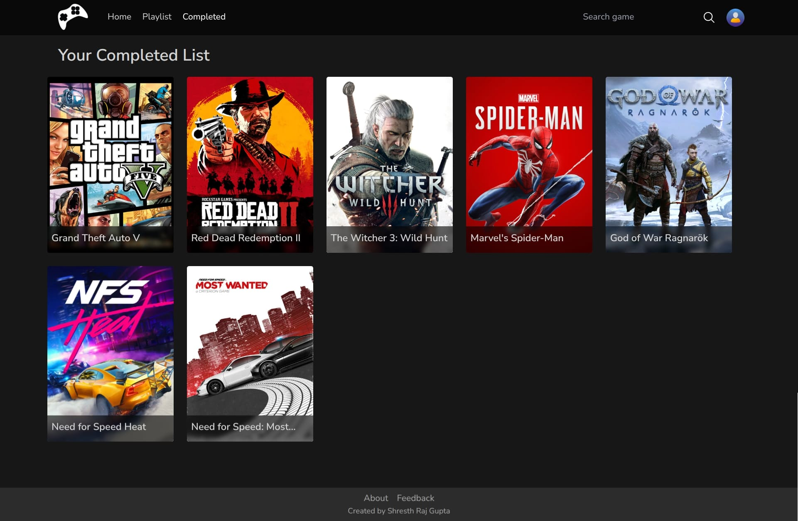
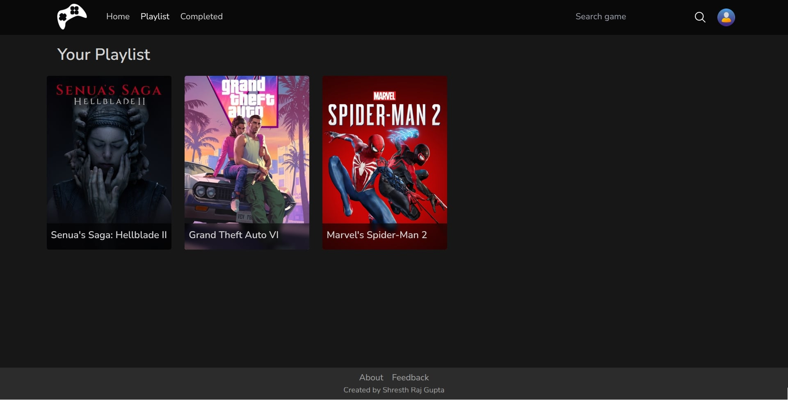

# GMDB – Game Management Database

GMDB is a web application designed to help gamers track their game progress. Whether you're currently playing, have completed, or plan to play a game, GMDB allows you to manage and monitor your gaming journey. Inspired by IMDb, GMDB brings a similar experience tailored for games.

### Screenshots











***

### Features
- **User Authentication**: Secure login and signup functionality to protect user data
- **Game Tracking**: Add games to your list and update their status (Playing, Completed, etc.)
- **Search Functionality**: Search for games to add to your collection
- **Responsive Design**: Optimized for various devices to ensure a seamless user experience

***

### Technologies Used
- **Frontend**: HTML, CSS, JavaScript
- **Backend**: Node.js, Express.js
- **Database**: MongoDB
- **Authentication**: JSON Web Tokens (JWT)
- **Version Control**: Git & GitHub

***

### Installation & Setup
1) Clone the repository:
```bash
git clone https://github.com/shresthrajgupta/gmdb.git
cd gmdb
```

2) Setup the backend:
```bash
cd server
npm install
npm start
```

3) Setup the frontend:
```bash
cd ../client
npm install
npm start
```

4) Access the application:
Open your browser and navigate to `http://localhost:3000`